\newpage
\

\newpage

\tableofcontents

\newpage

# Wstęp

\newpage

# Cel i zakres pracy

Celem pracy dyplomowej jest stworzenie implementacji algorytmu wykrywania wyjątków i poprawy dopasowania modelu.
Dodatkowym zadaniem poza zaimplementowaniem algorytmu jest stworzenie publicznej usługi internetowej która umożliwi analizę przesłanych danych. Usługa internetowa pozwoli na stworzenie abstrakcji nad zaimplementowanym algorytmem, dzięki czemu projekt może zostać zintegrowany z dowolną aplikacją lub innym serwisem
obsługujący zwykłą komunikację http.

Implementacja zarówno biblioteki algorytmu jak i serwisu ma zostać wykonana technologi Python.

Implementacja algorytmu powinna być wydajna lub porównywalna z innymi podobnymi algorytmami. Ponieważ algorytm zaproponowany przez Chen i Liu rozwiązuję problemy z detekcją wyjątków, określeniem typu wyjątku, sprawdzeniem wpływu na model szeregu czasowego i ostateczna poprawa modelu dopuszczalne
jest aby czas obliczeń był dłuższy on innych.

Usługa internetowa musi być dostępna nieprzerwanie, dlatego celem niefunkcjonalnym jest stworzenie usługi wykorzystując usługi chmurowe. Wdrożenie w chmurze będzie wiązało dodatkowym dostosowaniem aplikacji.

\newpage

# Przegląd literatury i analiza istniejących rozwiązań

Rozdział ten stanowi techniczne wprowadzenie do zagadnienia, oparte na analizie literatury i istniejących rozwiązań inżynierskich.
Analiza literatury i istniejących rozwiązań stanowi istotny etap procesu projektowego, umożliwiający lepsze zrozumienie kontekstu danego problemu oraz identyfikację potencjalnych obszarów doskonalenia. Rozdział skupia się na przeglądzie literatury związanej z tematyką pracy inżynierskiej oraz analizie istniejących rozwiązań, mającej na celu dostarczenie solidnej podstawy teoretycznej i technologicznej dla dalszych etapów badawczych.
W tym rozdziale zostaną dogłębnie poruszone teoretyczne kwestie związane z tematem pracy.

## Strumienie danych

Strumieniem danych nazywamy uporządkowany zestaw danych, gdzie każda wartość jest przypisana do określonego momentu czasowego.

Strumień składa się z punktów danych, najczęściej zbieranych w regularnych odstępach czasowych, co pozwala na dokładniejszą analizę zmian w czasie.
W ramach szeregów czasowych można identyfikować różne wzorce, trendy, sezonowe wahania oraz nieregularne zdarzenia.

W pracy A.Arsau, S.Babu, J.Widom[@python-docs] strumien danych jest nazywany nieograniczonym zbiorem elementów krotek należących do schematu strumienia i stempli czasowych tych elementów.

\begin{equation}
S = (s,t)
\end{equation}

Z tego wynika, że charakterystyczną naturalną cechą strumieni jest szeregowość. Wartości nie są jedynym przedmiotem analizy, ale głównie ich kolejność i kontekst który zarysowują w czasie.

Szeregi czasowe są używane do monitorowania i prognozowania zmian, co pozwala wspierać procesy decyzyjne w każdej dziedzinie biznesu.
Mogą obejmować dane z różnych dziedzin, takich jak gospodarka, nauki przyrodnicze, zdrowie, finanse czy technologia.

## Wykrywanie wyjątków w strumieniach danych

Procesy gromadzenia danych, mimo postępu technologicznego, zawsze niosą ze sobą pewne ryzyko i nie są idealne. Istnieje wiele czynników, zarówno technicznych, jak i ludzkich, które mogą wprowadzić błędy do zebranych danych.
Może on wynikać z wadliwego sprzętu pomiarowego, błędu ludzkiego lub przypadkowego zbiegu okoliczności. Dane przesyłane do analizy mogą zawierać szum, błędy pomiarowe, wartości niemożliwe lub w skrajnych przypadkach nie mieć wartości.

Proces czyszczenia danych stał się integralnym i fundamentalnym krokiem w procesie analizy danych, w szczególności w dzisiejszych czasach kiedy ilość przesyłanych danych z roku na rok jest coraz większa.

![Ilość danych stworzonych / pobranych / skopiowanych w latach 2010 - 2021 z prognozami do roku 2024 [@datavolume]](./img/data-volume.png)

Dzięki czyszczeniu analiza staję się dokładniejsza a modele lepiej spełniają swoją role w prognozowaniu kolejnych wartości. Podstawowym krokiem czyszczenia danych jest wykrywanie i usuwanie wyjątków z serii danych.

Wyjątkiem
: nazywamy obserwację, której wartość znacząco różni się od innych wartości w losowej próbie z populacji. Określenie "znacząco różni" nie jest precyzyjnym określeniem. Kontekst każdej analizy jest wyjątkowy. W rozumieniu tej definicji, każda analiza ma za zadanie zdefiniować czym i jaka będzie znacząca różnica.

## Efekt Maskowania

Efekt maskowania *(ang. masking effect)* jest obecnym problemem w wykrywaniu wyjątków, wpływa on negatywnie na dokonywane analizy. Dlatego metoda wykrywania wyjątków powinna być odporna na działanie efektu i wykryć zamaskowaną anomalię.

Maskowaniem
: wyjątku nazywamy zjawisko nie wykrycia wyjątku, z powodu wpływu większej anomalii na statystykę testową, która determinuję wyjątek.

Efekt maskowania może wystąpić w sytuacji, gdy analiza, z góry narzuca wykrycie i usunięcie ustalonej liczby wyjątków. Maskowanie wystąpi w przypadku nieoszacowania liczby wyjątków. Ciekawym przypadkiem jest sytuacja odwrotna, gdy założenie liczby wyjątków przeszacowuję faktyczną liczbę
wyjątków. Dochodzi do przeciwnego efektu zwanego **swamping**, kiedy element bliskiego skupiska zostaje rozpoznany jako wyjątek.

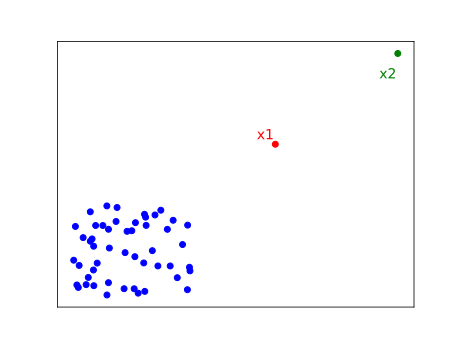{width=70%}

## Algorytm Chen-Liu
Praca Chung Chen i Lon-Mu Liu *"Joint Estimation of Model Parameters and Outlier Effects in Time Series"* dokumentuję algorytm analizy strumienia danych.
Podstawowym celem badań było przedstawienia procedury wykrywania wyjątków, która uwzględnia możliwość istnienia fałszywych i zamaskowanych wyjątków. Dodatkowo była w stanie obliczyć wpływ wyjątków na model, oraz oszacować nowe parametry modelu.

Dzięki precyzyjnemu zdefiniowaniu czterech różnych typów wyjątków, które pojawiały się w poprzednich badaniach, staje się możliwe pełniejsze zrozumienie ich wpływu na dane badawcze. Określenie obliczonego wpływu staje się kluczową podstawą do przeprowadzenia korekty parametrów modelu oraz umożliwia dalszą analizę.

Poniższy przykład bazuję na modelu ARIMA postaci:

\begin{equation}
Y_t = \frac{\theta(B)}{\alpha(B)\phi(B)}
\end{equation}

Procedura "Chen-Liu" przedstawia szereg czasowy w następujący sposób:
\begin{equation}
Y_t^* = Y_t + \omega \xi (B) I_t(t_1)
\end{equation}

Gdzie:

- Funkcja $I_t$ przyjmuję wartość 1 kiedy występuję wyjątek w każdym innym wypadku jest równa 0.
- $\omega$ jest początkową wartością odchylenia
- $\xi (B)$ określa jak będzie kształtował się wpływ wyjątku w czasie.


Algorytm przyjmuję rozróżnia następujące wyjątki na następujące typy:

- *Additive Outlier* (AO): Efekt charakteryzuję się pojedynczą, nagłą anomalią.

\begin{equation}
AO: \xi (B) = 1
\end{equation}

- *Level Shift* (LS): Trwały, ciągła zmiana wartości.

\begin{equation}
LS: \xi (B) = \frac{1}{1 - B}
\end{equation}

- *Temporary change* (TC): Efekt słabnie w czasie. Dodatkowym parametrem jest $\delta$ która określa krzywiznę.

\begin{equation}
TC: \xi (B) = \frac{1}{1 - \delta B} \quad \quad \quad 0 < \delta < 1
\end{equation}


- *Innovational Outlier* (IO): Krzywa w czasie jest odzwierciedleniem modelu. W przypadku modelu ARMA wygląda następująco:

\begin{equation}
IO: \xi (B) = \frac{\theta(B)}{\alpha(B) \phi(B) }
\end{equation}

W późniejszych pracach i implantacjach [@kaiser1999seasonal] można napotkać na 5 typ wyjątków $SLS$. Ma za zadanie lepiej odwzorcowywać sezonowość szeregu czasowego niż typ IO, który nie musi dziedziczyć cech sezonowości z przyjętego modelu.

\begin{equation}
SLS: \xi (B) = 1/S \quad \quad \quad S = 1 + B + ... + B^{s-1}
\end{equation}

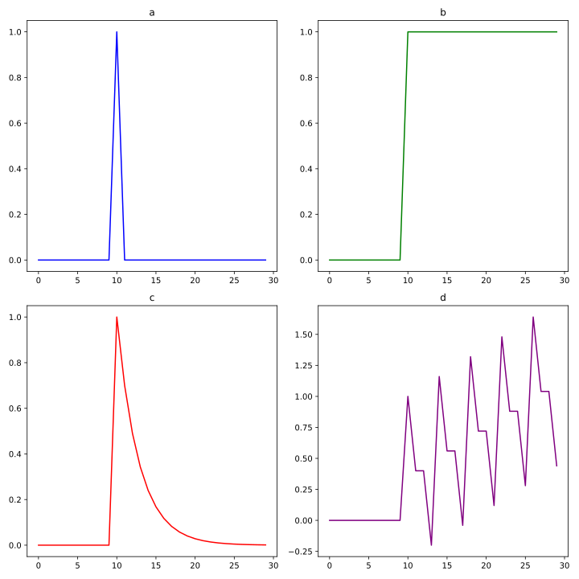{width=95%}


Algorytm postępowania jest iteracyjny i jest podzielony na 3 oddzielne etapy. Przedstawione poniżej kroki algorytmu są uproszczone. Dokładny opis procedury można znaleźć w oryginalnej pracy[@chen1993joint]:

#. Obejmuję wykrycie potencjalnych wyjątków. W tym celu dokonuję się dopasowania przyjętego modelu do serii danych i obliczenia odchyleń dla każdego punktu.
W następnym kroku, dla każdego punktu i szukanego typu obliczane są statystyki $\tau$ i $\omega$. Jeśli statystyka $| \tau |$ w czasie $t$ jest większa niż przyjęta wartość krytyczna $C$ oznacza, że w tym punkcie wystąpił wyjątek.
Jeżeli 2 lub więcej typów przekroczyła wartość krytyczną wybierany jest typ z największym współczynnikiem $\tau$.
Następuję obliczenie efektów wykrytych wyjątków i usunięcie z serii danych. Poprawiona seria danych zostaję ponownie analizowana zgodnie z poprzednimi krokami, dopóki w iteracji nie zostanie wykryty żaden wyjątek, lub zostanie przekroczona ustalona liczba iteracji.

#. W tym etapie zostaję sprawdzony wpływ potencjalnych wyjątków. Do tego celu zostaje użyty model regresji obliczyć wielkość wyjątku $\hat{\omega}$.
Obliczana jest ponownie $\tau_j$ korzystając ze wzoru: $\hat{\tau}_j = \hat{\omega}_j / std(\omega)$. Jeśli statystyka jest niższa niż wartość krytyczna $C$ wyjątek jest usuwany z listy potencjalnych. Pętla zostaję przerwana w przypadku braku wykrycia błędu lub przekroczenia liczby iteracji.
Następuję kolejne dopasowanie modelu skorygowanej serii.

#. Ostatnim etapem jest powtórzenie pierwszej i drugiej fazy algorymu wykorzystując nowe parametry modelu: W pierwszej fazie nie koryguję parametrów. W drugiej fazie $\hat{\omega}$ jest końcową wartością.

\newpage


## Wykrywanie wyjątków w systemach informatycznych

Algorytm "Chen-Liu" nie jest jedynym algorytmem wykrywania wyjątków. Na przestrzeni lat postało wiele metod stworzonych w tym celu.
Przykładami takich algorytmów są:

- Isolation Forest
: Jedna z najnowszych metod wykrywania wyjątków. Metoda polega na wykorzystaniu drzew binarnych do losowego podziału serii danych. Implementacja jest dostępna w wielu językach programoawnia tj Python, R i dostępna dla platformy Apache Spark. [@iforest]

- Auto enkodery
: Grupa algorytmów oparta na sztucznej inteligencji. Główna idea stojąca za autoenkoderami polega na nauczeniu się skompresowanego przedstawienia lub kodowania danych wejściowych. Anomalie są wykrywane poprzez pomiar błędu rekonstrukcji między wejściem a odtworzonym wyjściem.

Istnieje dużo dziedzin gdzie wykrywanie wyjątków znalazło zastosowanie. Algorytmy są stosowanie w cyberbezpieczeństwie jako systemy **IDS** *(Intrusion Detection System)*. Takie systemy mogą bazować na sztucznej inteligencji lub działać na zasadzie data-miningu.


Dzięki algorytmom, możliwe jest wykrywanie oszustw bankowych. Przykładem takich aplikacji jest "SEON".

Wykrywanie wyjątków znalazło zastosowanie w systemach IOT, zarządzaniu infrastrukturą IT jak i mikro serwisów. Algorytmy stają się pomocne przy wykrywaniu usterek sprzętu. Wczesne wykrycie problemów z wydajnością systemów zwiększa jakość, efektywność i stabilność samego systemu jak i biznesu.

Przykładem oprogramowania służącej do monitorowania zasobów aplikacji / klastra jest Grafana, która daję możliwość podglądu na żywo statystyk CPU, pamięci, transferu internetowego. Grafana udostępnia płatnym użytkownikom wykrywanie wyjątków w wybranych strumieniach i zintegrowanie z systemem powiadomień.[@grafana-docs]

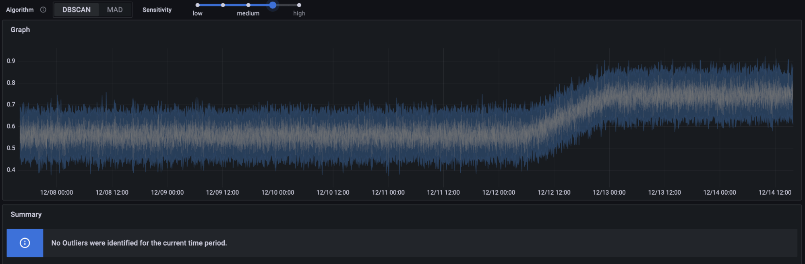

Istnieją rozwiązania w postaci bibliotek. Sektorem, w którym wykrywanie wyjątków jest szeroko stosowane są media społecznościowe. Firmy takie jak Meta *(dawniej Facebook)* czy X *(dawniej Twitter)* udostępniają kod swoich bibliotek przeznaczone do analizy danych i  wykrywania wyjątków [@twitter-docs] [@prophet-docs].

Popularnymi bibliotekami w języku python są scikit-learn i TODS. Zaletą bezpośredniego użycia metody jest elastyczność rozwiązania, jednak wymagają pracy specjalistów w dziedzinie analizy danych [@scikit-learn] [@Lai_Zha_Wang_Xu_Zhao_Kumar_Chen_Zumkhawaka_Wan_Martinez_Hu_2021].


## Podsumowanie

Analiza strumieni danych jest popularnym i prężnie rozwijanym tematem w obecnej stanie technologi informatycznych. Niewątpliwie algorytmy bazujące na sztucznej inteligencji otwierają kolejne kierunki rozwoju. Z tego powodu istnieje ryzyko wyparcia metod tradycyjnych na rzecz technologi uczenia
maszynowego.
Jednakże, przedstawiona metoda "Chen-Liu" wyróżnia się swoimi właściwościami, a wyniki w postaci klasyfikacji wykrywanych wyjątków, mogą wzbogacić analizę danych.

Język Python jest jednym z najpopularniejszych języków w dziedzinie analizie danych, dlatego implementacja zaprojektowana dla tego języka, może być
najbardziej dostrzeżona i jednocześnie najprzydatniejsza dla społeczności.


\newpage

# Metodologia i implementacja projektu

Ten rozdziej opisuję szczegóły implementowanego rozwiązania. Zostaną poruszone dogłębnie aspekty techniczne i wykorzystanej technologii. Zostanie też przedstawiony proces implementacji jak i etap wdrożenia aplikacji.

## Wymagania

Wymagania odnośnie aplikacji możemy podzielić na funkcjonalne i niefunkcjonalne:

Funkcjonalne:

- Algorytm musi przedstawiać wynik analizy w formie listy wykrytych wyjątków i statystyk modelu.
- Użytkownik może przetestować zbiór danych.
- Rozwiązanie udostępnia możliwość przesłania serii danych do analizy w postaci pliku csv.
- Użytkownik może prosić o wygenerowanie danego typu efektu.
- Serwis daję możliwość połączenia efektów w jedno rozwiązanie.

Niefunkcjonalne:

- Wyjątki muszą być kategoryzowane.
- serwis być odporna na znaczny ruch.
- serwis przedstawia swój stan zdrowia.
- serwis loguję kolejne kroki postępowania wg przyjętego formatu.
- aplikacja musi być bezstanowa aby była lepiej skalowalna.


## Wybór technologii

Główną technologią użytą do implementacji algorytmu jak i usługi jest język Python. Python jest doskonałym narzędziem do szybkiego tworzenia aplikacji. Dodatkowo Python jest popularnym językiem w społeczności analityków danych.

Biblioteki wykorzystane w implementacji modułu algorytmu to:

- Numpy
: popularna i ceniona biblioteka przeznaczona do obliczeń na macierzach. Głównym typem wykorzystywanym do obliczeń jest ``Ndarray``. Numpy daję możliwości zaawansowanych operacji na macierzach, stosowanie filtrów i przekształceń.
Plusem biblioteki jest implementacja krytycznych funkcji i struktur w języku C. W ten sposób biblioteka łączy ze sobą efektywny kod i udostępnia proste struktury Python'a. [@numpy-docs]

- Pandas
: Biblioteka, która udostępnia struktury danych i narzędzia do sprawnego manipulowania danymi numerycznymi i tabelarycznymi. Pandas jest. Pandas jest szczególnie przydatny do analizy danych, przetwarzania danych i pracy z danymi czasowymi. Pandas oferuje wiele funkcji umożliwiających łatwe wczytywanie danych z różnych źródeł (takich jak pliki CSV, Excel, bazy danych), manipulowanie nimi, grupowanie, filtrowanie, agregację, a także operacje na czasie. [@pandas-docs]

- Statsmodels
: Biblioteka, zaprojektowana do statystycznego modelowania danych. Jest używana głównie do analizy danych, testowania hipotez, tworzenia modeli regresji i wielu innych zastosowań w dziedzinie statystyki i ekonometrii. StatsModels dostarcza narzędzi do estymacji modeli statystycznych, testowania hipotez, prowadzenia analizy czasowej i wielu innych operacji statystycznych. [@statsmodels-docs]

Biblioteki i technologie użyte do tworzenia serwisu:

- FastAPI, Pydantic i Uvicorn
: Biblioteka programistyczna, która umożliwia szybkie tworzenie aplikacji internetowych zgodnych z protokołem RESTful. Jest oparta na standardzie Python oraz bazuje na bibliotekach standardowych. FastAPI jest znane ze swojej wysokiej wydajności, automatycznego generowania dokumentacji API i łatwości użycia. FastAPI wykorzystuję bibliotekę Pydantic do tworzenia klas DTO (Data Tranfer Objects), serializacji danych i na ich podstawie tworzenia dokumentacji interfejsu REST. Biblioteka Uvicorn jest asynchronicznym serwerem http.

- Konteneryzacja Docker
: Docker jako technologia wirtualizacji na poziomie jądra systemu operacyjnego jest idealnym rozwiązaniem. Konteneryzacja zapewnia stałe środowisko uruchomieniowe aplikacji. Dzięki zastosowaniu technologi produkt zyskuję na jakości poprzez standaryzację, elastyczność dla największych chmur obliczeniowych. Aplikacja staję łatwo skalowalna i zarządzanie instancjami jest łatwiejsze. Poza izolacją aplikacji budowanie obrazów Docker otwiera możliwości lepszej pracy nad projektem i wprowadzania technik DevOps tj. CI/CD pipelines.

- Chmura Google Cloud (GCP)
: Chmura obliczeniowa Google jest jedną z największych dostawców usług chmurowych na świecie. Usługi chmury pozwalają na szybkie i automatyzowane wdrażanie aplikacji lub konfiguracji infrastruktury. Chmura jest prężnie rozwijaną technologią, ponieważ z perspektywy biznesu chmura jest szansą na
zaoszczędzenie kosztów związanych z utrzymaniem własnej infrastruktury i specjalistów związanych nimi związanymi. Koszty stają się bardziej przewidywalne dzięki cennikom i kalkulatorom. Google dzięki SLA (https://cloud.google.com/run/sla) gwarntuję dostępność usług na poziomie 99.5% w skali miesiąca. Jeżeli usługa nie osiągnie wzorowej dostępności poprzez (np. zbyt duży "Error Rate" nie związany z wdrożoną aplikacją), Google zwraca koszt według cennika.


## Zastosowane narzędzia

- Git & Github
: System zarządzania kodem. Użycie systemu wersjonowania jest kluczowy w perspektywie dalszej rozwoju projektu jak i ułatwia dokumentację projektu. Zewnętrzne repozytorium Github pozwala na przechowywanie projektu pozawala na udostępnianie projektu społeczności i możliwej kontrybucji.

- Terraform
: Narzędzie służące do automatyzacji infrastruktury chmurowej. Projekt Open Source stworzony przez Hashicorp, który pozwala na zastosowanie technik IaC i otwiera możliwości automatyzacji poprzez techniki Devops.

- Narzędzia jakości kodu
: Niewątpliwie narzędzia formatowania poprawiają jakość oprogramowania poprzez wymuszenie przyjętych standardów. Formater kodu python "Blue" udostępnia narzędzie CLI dzięki czemu proces formatowanie można łatwo zintegrować z edytorem kodu. Warto aby edytor tekstu wspierał funkcje LSP (Language Server Protocol) lub dodawał funkcję wspomagające prace przy kodzie tj. podświetlanie błędów składni przed uruchomieniem kodu, wyświetlanie dokumentacji funkcji / klas , przewidywanie użytych i zwracanych typów.

## Implementacja algorytmu

Implementacja algorytmu znajduję się w oddzielnym module 'algorithm'. Moduł ma za zadanie zwrócenie analizy zgodnie z metodą opisaną przez poprzednim rozdziale.

Biblioteka stara się być możliwie minimalistyczna. Dla zapewnienia możliwie najlepszej wydajności implementacja unika tworzenia nowych klas i abstrakcji nad użytymi bibliotekami, które mogłyby potencjalnie spowolnić wykonywanie obliczeń.

Jednym z problem stojącym przed implementacją 1 fazy algorytmu, jest dokonanie transformacji przyjętego modelu do postaci:

\begin{equation}
\pi(B) = \xi(B) = 1 - \pi_1B - \pi_2B^2...
\end{equation}

Tym zadaniem ma się zająć funkcja `arma2ma`, która przyjmuje parametry AR i MA dla modelu ARIMA oraz oczekiwany stopień wielomianu $\pi$.

```python
def arma2ma(ar, ma, lag_max):
    ar = ar.tolist() if isinstance(ar, np.ndarray) else ar
    ma = ma.tolist() if isinstance(ma, np.ndarray) else ma

    if not isinstance(ar, list):
        ar = [ar]
    if not isinstance(ma, list):
        ma = [ma]

    if len(ar) == 0:
        ar = [1]
    if len(ma) == 0:
        ma = [1]

    p = len(ar)
    q = len(ma)
    m = int(lag_max)

    logging.debug(f'ar: {ar}')
    logging.debug(f'ma: {ma}')
    if m <= 0:
        raise ValueError('Invalid value of lag_max')

    psi = np.zeros(m)
    for i in range(m):
        tmp = ma[i] if i < q else 0.0
        for j in range(min(i + 1, p)):
            tmp += ar[j] * (psi[i - j - 1] if i - j - 1 >= 0 else 1.0)
        psi[i] = tmp

    return psi
```

Funkcja przed wykonaniem poprawnych obliczeń musi sprawdzić czy podane argumenty są postaci listy. Jeżeli wykryte obiekty typu `numpy.Ndarray` są konwertowane do list. Zauważyć można logowanie parametrów AM i MA.

Logowanie odbywa się poprzez zmienna `logging`, która jest konfigurowana w module `logger.py`

```python
logging.basicConfig(
    level=logging.DEBUG,  # Set the logging level (DEBUG, INFO, WARNING, ERROR, CRITICAL
    format='[%(asctime)s] %(levelname)s %(funcName)s:\n %(message)s',  # Define the log message format
    datefmt='%Y-%m-%d %H:%M:%S',  # Define the date-time format
)
```

Konfiguracja w tym formacie pozwala na czytelne sprawdzenie działania aplikacji. Aplikacja jest zaprojektowana do działania w chmurze obliczeniowej. Z związku z tym logi nie są zapisywane do zewnętrznego pliku, tylko przesyłane do strumieni `stdout` i w przypadku błędów `stderr`. Dzięki temu
podejściu rozwiązanie jest bardziej otwarte na integracje z narzędziami przeznaczonymi do analizy i agregacji logów.
Przykładem może być platforma Kubernetes(k8s), czy Grafana Loki które domyślnie pobiera logi ze strumieni kontenerów, aby później móc procesować i wyświetlić wyniki analiz.

Najważniejszym etapem jest obliczenie współczynników $\hat{\omega}$ i $\hat{\tau}$ dla każdego punku i typu w zbiorze danych. Równania współczynników są różne dla każdego typu. W tym miejscu dokonano optymalizacji kodu poprzez zbiorowe obliczenia współczynników wykorzystując bibliotekę numpy.

Wyniki obliczeń są zapisywane do postaci obiektów Dataframe, które dalej będą prezekazywane.

## Moduł REST

Moduł interfejsu REST pozawala na zdalnie testowanie zbiorów danych i sprawdzanie wyników analizy.

Interfejs zapewnia metody GET dla sprawdzenia generowania effektów.

Najważniejszy enpoint jest związany z przesyłaniem pliku do analizy. Przesyłanie pliku jest osiągnięte poprzez rozszerzenie biblioteki FastAPI `UploadFile`. W dalszych etapach funkcji następuję walidacja pliku. Funkcja obsługuję pliki csv istara się odczytać wybraną serię.
Endpoint udostępnia możliwość zaznaczenia, że pierwsza linia zawiera tytuły i pozwala na wybranie kolumny z danymi

```python
@app.post('/analyze/')
async def analyze_file(
    file: UploadFile,
    cval: float = 2,
    have_header: bool = False,
    col: int = 0,
) -> AnalyzeResult:
```

Zwrot analizy jest podany w postaci klasy `AnalizeResult`. Biblioteka Pydantic jest szczególnie przydatna w tym wypadku.
Poprzez stworzenie klas pochodnych  klasy `BaseModel` Konstruktory i podstawowe metody dostępu są automatycznie zaimplementowane.

Biblioteka FastAPI potrafi integrować się z przekazaną klasą i stworzyć odpowiedni endpoint, który można można sprawdzić poprzez endpoint `/docs`. Dodatkowym plusem jest fakt automatycznej aktualizacji manifestu openAPI który jest oficialną dokumentacją interfejsu.

```python
class Entry(BaseModel):
    index: float
    origin: float
    effect: float
    result: float
    AO: float | None
    IO: float | None
    TC: float | None
    LS: float | None

class AnalyzeResult(BaseModel):
    id: UUID
    time: datetime
    data: list[Entry]
    raport: Raport
```

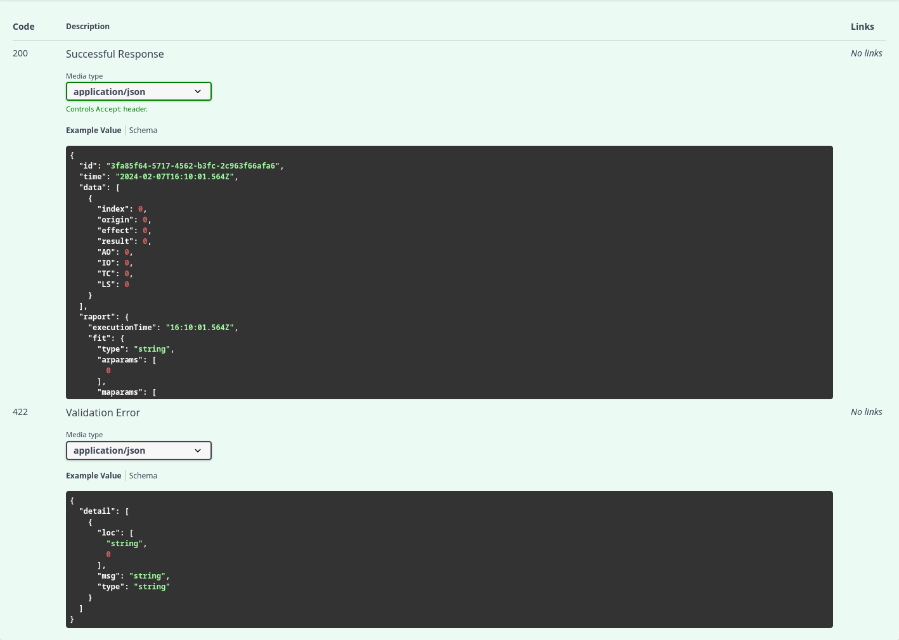

## Docker

Jak wcześniej zostało wspomniane konteneryzacja aplikacji jest ważnym aspektem w dalszego wdrażania i utrzymania aplikacji w spójności.

```dockerfile
FROM python:3.11.6-alpine
RUN apk --no-cache add curl
COPY ./requirements.txt /code/requirements.txt
RUN pip install -r /code/requirements.txt
COPY . /code
EXPOSE 80
CMD ["uvicorn", "code.app.main:app", "--host", "0.0.0.0", "--port", "80"]
HEALTHCHECK --interval=10s --timeout=3s \
  CMD curl -f http://localhost/health || exit 1
```

Warto zwrócić uwagę na rozdzielenie pliku requirements.txt od pozostałego kodu aplikacji. W takim ustawieniu warstw podczas budowania możliwe jest zaoszczędzenie czasu poprzez wykorzystanie mechanizmu cachowania warstw.
Plik `requirements.txt` jest plikiem zawierającym wszystkie wymagane zależności dla aplikacji. Generowany jest poprzez komendę `pip freeze`.

Jeżeli jednak zmiany w aplikacji nie dotyczą zewnętrznych bibliotek mechanizm wypychania obrazów i budowania wykorzysta z pamięci cache z poprzednich akcji.

Wykorzystanie polecenia `EXPOSE 80` nie wpływa na budowany obraz aplikacji. Jest jedynie dobrą praktyką która dokumentuję porty na których aplikacja nasłuchuję.

Dobrą praktyką tworzenia obrazów jest zdefiniowanie testu `HEALTHCHECK`. Może się okazać przydatną informacją o stanie aplikacji dla systemów orkiestracji takich jak Kubernetes.

Dodatkiem pomocnym podczas aktywnej pracy developerskiej jest plik compose.yaml, który automatycznie potrafi aktualizować edytowany serwis oraz odtworzyć lokalną infrastrukturę. W przypadku projektów python wymagane jest tylko montowanie odpowiednich wolumenów z plikami projektu.

Aby zbudować aplikację, należy wykonać komendę.

```bash
docker build . --tag chenliu
```

Oczywiście nazwa może się różnić. Uruchomienie aplikacji jest wykonywane poprzez komendę, jednocześnie wiążąc porty 8080 Hosta z portem 80 kontenera.

```bash
docker run -p 8080:80 chenliu
```

## Chmura obliczeniowa

W powyższy sposób aplikacja jest przygotowana do łatwego wdrożenia. Chmura obliczeniowa, umożliwa łatwe wdrożenie aplikacji i archiwizowanie zmian obrazów.

Projekt wykorzystuję usługi Google Cloud (GCP), lecz sposób wdrożenia jest podobny dla każdych popularnych dostawców usług chmurowych.

Pierwszym etapem jest stworzenie repozytorium dla stworzonych obrazów. Google cloud udostępnia usługę "Artifact Registry" gdzie stworzone jest standardowe repozytorium dla obrazów docker - `pzuchowski`.

Po utworzeniu rejestru możliwe jest wypychanie dowolnych obrazów aplikacji poprzez `docker push`

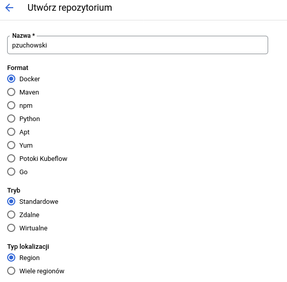{width=80%}

Uruchamianie instancji obrazu odbywa się poprzez usługę "Cloud Run". Cloud Run pozwala na uruchomienie instancji prywatnego repozytorium i wstępną konfigurację usługi.

Zaletą tego rozwiązanie jest odciążeniem dewelopera od zadań związanych z zarządzaniem aplikacją i ręcznym tworzeniem Load Balancerów dla aplikacji.

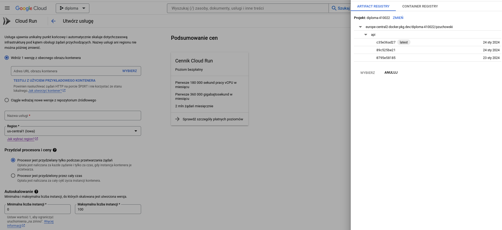


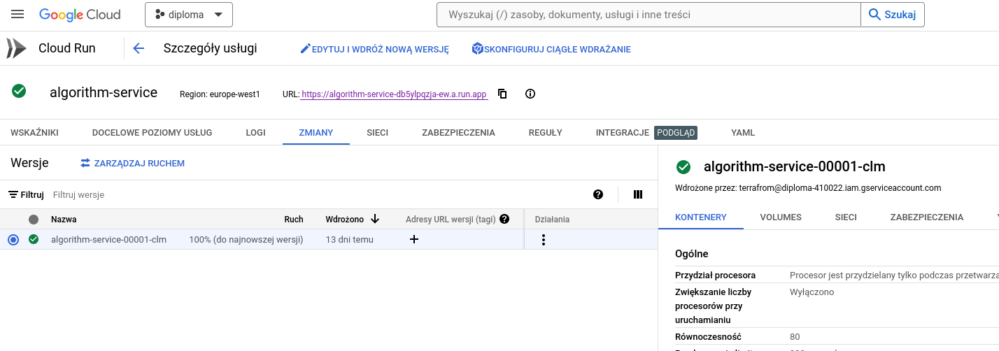

Usługa Cloud Run pozwala też na przeglądanie statystyk aplikacji i tworzenie alertów w przypadku naruszenia ustalonych reguł oraz przeglądania logów.

## Infrastruktura jako Kod

Rozwiązanie przedstawione powyżej spełnia swoje zadanie. Aplikacja została sukcesywnie wdrożona na gdzie możemy otrzymywać raporty z logów oraz alerty w razie niepowodzeń.

W dłuższej perspektywie i dalszych pracach nad projektami zaczyją pojawiać się problemy z automatyzacją czy dokumentacją infrastruktury aplikacji.

Dlatego warto we czesnych etapach projektu zapisać utrwalić infrastrukturę w postaci kodu.
Przy użyciu narzędzia Terraform możliwe jest utrwalenie infrastruktury i bezpieczne przechowywanie w repozytorium Git.

Wdrożenie aplikacji z pomocą narzędzia Terraform wymaga pobrania klucza dostępu roli użytkownika i zintegrowanie z konfiguracją.

Wdrożenie definicja wdrożenia instancji składa się z definicji `google_cloud_run_v2_service` gdzie są zdefiniowane porty kontenera, lokalizację usługi czy ustawienia load balacingu.

Aby udostępnić instancję jako publiczne API wymagana jest konfiguracja IAM poprzez odpowiedni definicje `google_iam_policy` i połączenie w `google_cloud_run_v2_service_iam_policy`
\newpage

# Opis przeprowadzonych testów

W rozdziale dotyczącym testowania implementacji algorytmu skupia się na kluczowym aspekcie procesu tworzenia oprogramowania – zapewnieniu jakości poprzez systematyczne testowanie.
Testowanie implementacji algorytmu jest niezwykle istotne dla zapewnienia poprawnego działania systemu oraz oczekiwanych wyników.
Rozdział przedstawia szczegółowy plan testów, obejmujący cele, strategie, środowisko testowe oraz rodzaje testów, mając na celu zaprezentowanie kompleksowego podejścia do sprawdzania funkcjonalności algorytmu.

Poprzez analizę wyników testów oraz ocenę ich efektywności, będziemy starali się przedstawić wnioski i zidentyfikowali ewentualnych problemów w implementacji.


## Wydajność algorytmu na zbiorach danych

Testy wydajności algorytmu zostały dokonano na zbiorach pochodzących z repozytorium forcasting.org [@focasting]. Repozytorium stworzone jest z myślą o badaniu modeli pracujących na szeregach czasowych.
Repozytorium Monash zaproponowało własny format plików `tsf`przeznaczonych do zapisywanie danych wielowymiarowych.

Zaproponowany format plików wymaga dodatkowej obsługi przy konwersji do obiektu `DataFrame`. Wadą plików i strony jest brak związanych z czego poszczególne serie danych dotyczą. W

Testy algorytmu nie zostały przeprowadzone na wszystkich seriach danych. Zbiory danych zostały wybrane ręcznie różniące się na objętością, trendu danych, czy specyficzną charakterystyką, aby przedstawić zachowanie algorytmu na różnych zbiorach.


### Nile dataset

Nile dataset to popularny zbiór danych dostępny w języku R, który zawiera informacje o rocznym przepływie rzeki Nil. Zbiór zwiera roczne przepływu Nilu w Asuanie (dawniej Assuan) między latami 1871-1970. Jednostką miary są $10^8m^3$, z widocznym punktem zmiany w pobliżu 1898 roku.

Jest to często używany zestaw danych w analizie danych i statystyce, ze względu na swój historyczny charakter.

Dataset Nile zawiera dwie kolumny:

1. Year (Rok): Określa rok pomiaru przepływu rzeki Nil.
2. Flow (Przepływ): Zawiera informacje o rocznym przepływie rzeki Nil w $10^8m^3$ w mieście Assuan.


Tabela 1. Wydajność algorytmu dla zbioru "Nile"

| Statystyka   | wartość   |
|--------------- | --------------- |
| ilość rekordów   |  100 |
| użyta pamięć [KB]   |  9616.00  |
| czas przetwarzania [s]   |  0.9021 |


Tabela 2. Wykryte wyjątki dla zbioru Nile

| Indeks | Typ | $\hat{\omega}$ | $\hat{\tau}$ |
| --- | --- |:------:|:---:|
| 35   |  LS    | 137.002975    | 1.343409   |

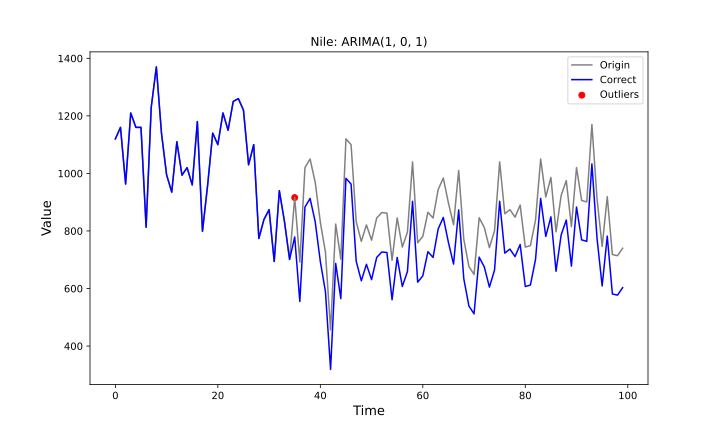

### Śmiertelność wirusa COVID-19

Seria danych zawiera informacje na temat łącznej liczby zgonów spowodowanych lub związanych z wirusem COVID-19 na terenie Polski. Długość serii wynosi 495, są do wartości dzienne zaczynające się od 22 lutego 2020r. do 31 maja 2021r. Seria nie zawiera  pustych wartości.

Zbiór danych pochodzi z publicznego repozytorium Johns Hopkins University, dostępny na platformie github [@DONG2020533]. Dane, na dla potrzeby testów zostały przefiltrowane i skrócone.

Celem testu jest sprawdzenie zachowania się algorytmu dla danych rozpoczynają się serią zer. Dane łącznych przypadków śmiertelnych dobrze spiszą się do tego celu. Większość serii z innych państw / stanów / miast mogą mieć podobne wartości pod względem tworzonej krzywizny, ale być w różnej skali.

| Statystyka   | wartość   |
|--------------- | --------------- |
| ilość rekordów   | 395  |
| użyta pamięć [KB]   |  28300.00  |
| czas przetwarzania [s]   |  2.8876 |


| Indeks  | Typ | $\hat{\omega}$ | $\hat{\tau}$ |
| --- | --- |:------:|:---:|
|290 | LS | 377.624460| 2.743099|
|308 | IO | 530.860709| 2.879998|
|310 | IO | 494.771605| 2.684209|
|332 | AO |-208.824617|-2.768120|
|333 | LS | 469.221737| 3.408470|
|338 | IO | 565.595406| 3.068439|
|350 | AO |-215.592701|-2.857836|
|351 | LS | 557.277591| 4.048116|
|385 | AO | 217.189932| 2.878665|
|386 | AO |-296.255695|-3.926023|
|387 | LS | 633.392286| 4.599533|

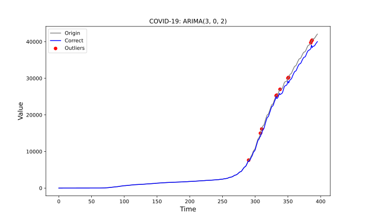

### Sprzedaż sklepów Dominick

Dane pochodzą z sieci magazynów Dominick.

Zbiór danych zawiera 115704 tygodniowych szeregów czasowych reprezentujących zysk poszczególnych jednostek magazynowych od sprzedawcy detalicznego.

Do testów zostały wykorzystane 2 szeregi T1 i T10.

Szereg T1 charakteryzują początkowe skoki danych różnymi od zera. Dane poniżej zera nie mają uzasadnienia w rzeczywistości. Szereg czasowy po nieregularnej fazie początkowej stabilizuję się do wartości zerowej. Celem testu jest obserwacja algorytmu na powyższym typie zbiorów.

| Statystyka   | wartość   |
|--------------- | --------------- |
| ilość rekordów   | 92  |
| użyta pamięć [KB]   |  16572.00  |
| czas przetwarzania [s]   |  0.7350 |


| Indeks  | Typ | $\hat{\omega}$ | $\hat{\tau}$ |
| --- | --- |:------:|:---:|
|0 | IO|-26.730718|-16.598713|
|1 | IO| -6.641221| -4.123934|
|2 | AO|  3.573929|  4.370635|
|3 | TC|-10.003285| -8.100266|
|4 | IO| 11.103853|  6.895051|

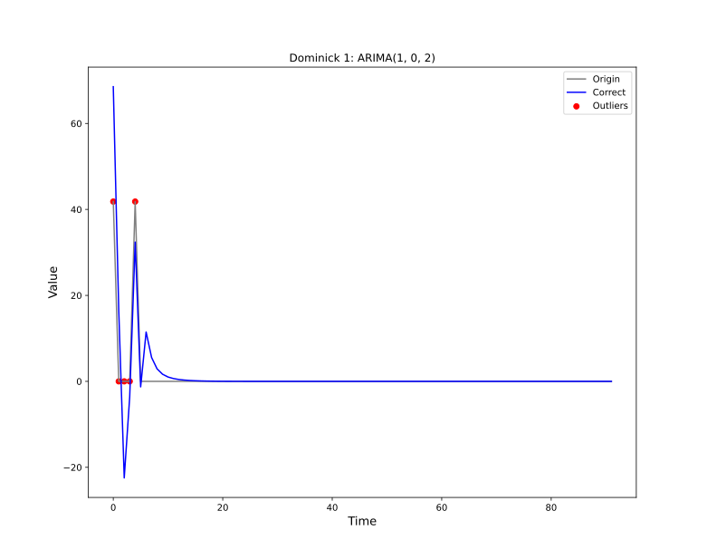

Zgodnie z oczekiwaniami zostały wykryte wyjątki w pierwszych, nieregularnych punktach. Doszło jednak do niepożądanego wzmocnienie efektów i przekroczenie wartości poniżej zera.


Szereg T10 również nie przyjmuję wartości poniżej zera. Dane charakteryzują się nieregularnością w postaci nagłych zmian wartości przyjmujących kształt kwadratowy. Szereg czasowy zawiera różne wartości liczbowe. Wartości te oscylują między około 0 a 75.68.

Celem testu jest obserwacja zachowania algorytmu dla serii danych "skokowych", nieregularnych, przypominających sygnał kwadratowy.


| Statystyka   | wartość   |
|--------------- | --------------- |
| ilość rekordów   |  393 |
| użyta pamięć [KB]   |  37416.00  |
| czas przetwarzania [s]   |  4.6710 |


| Indeks  | Typ | $\hat{\omega}$ | $\hat{\tau}$ |
| --- | --- |:------:|:---:|
|228 | TC|-70.559254|-2.289646|
|299 | TC| 66.529967| 2.158896|
|359 | TC| 74.309658| 2.411346|

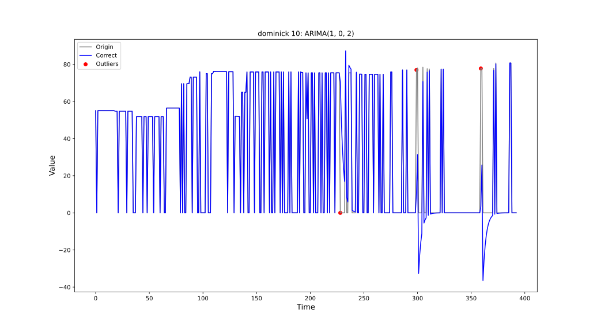

Algorytm również w tym przypadku przekroczył wartości poniżej zera. Jednak zostały wykryte wartości odstające w końcowej części serii, gdzie znajdowały się wzrosty, które różniły się od kwadratowej natury serii.


### CIF 2016

Zbiór danych CIF 2016 zawiera 72 miesięczne szeregi czasowe pochodzące z dziedziny bankowej, używane w konkursie prognozowania CIF 2016. Spośród 72 szeregów czasowych, 24 szeregi zawierają dane czasu rzeczywistego, podczas gdy pozostałe 48 szeregów zostały wygenerowane sztucznie. W konkursie rozważane są dwie horyzonty prognozowania, gdzie 57 szeregów uwzględnia horyzont prognozowania równy 12, a pozostałe 15 szeregów uwzględniają horyzont prognozowania równy 6.

Test został przeprowadzony na szeregu T1, który ma trend rosnący oraz zawiera punktowe odchylenia.

| Statystyka   | wartość   |
|--------------- | --------------- |
| ilość rekordów   |  120 |
| użyta pamięć [KB]   |  13564.00  |
| czas przetwarzania [s]   |  0.8951 |

| Indeks  | Typ | $\hat{\omega}$ | $\hat{\tau}$ |
| --- | --- |:------:|:---:|
|0    |AO | 230.251050 | 6.047273|
|1    |IO |-214.407818 |-4.758515|
|2    |IO | -88.895226 |-1.972919|
|71   |AO | -64.863290 |-1.703558|


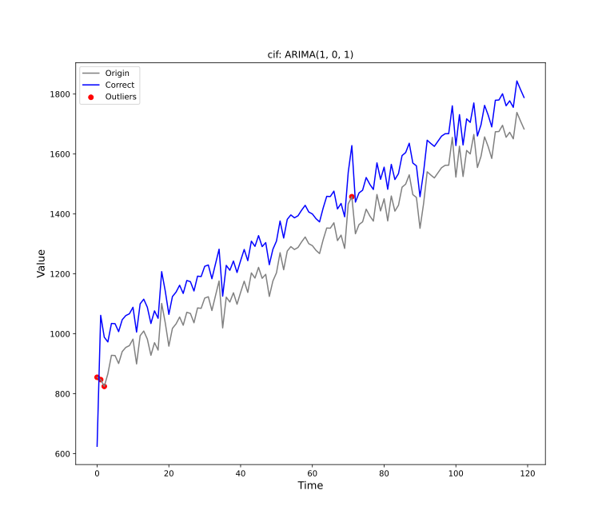

Efekty wyjątków wykrytych w pierwszych trzech wartościach znacznie pływają na kształt całego modelu. Wyjątek na poziomie 71 znacząco wyróżniał się na tle sąsiadujących wartości.


### Opady deszczu

Zbiór danych zawiera 32072 szeregi czasowe przedstawiające obserwacje temperatury oraz prognozy opadów deszczu, zebrane przez Australijski Urząd Meteorologiczny dla 422 stacji meteorologicznych na terenie Australii, w okresie od 2 maja 2015 roku do 26 kwietnia 2017 roku.

Do testów został wykorzystany szereg T1, który zawiera informacje z miernika opadów atmosferycznych. Wolumen danych jest największy, zawiera wartości zerowe i może zawierać luki.

Celem testu jest zbadanie zużytych zasobów i czas wykonania obliczeń dla bardzo dużych zbiorów danych i przedstawienia rozwiązania.

| Statystyka   | wartość   |
|--------------- | --------------- |
| ilość rekordów   |  4254 |
| użyta pamięć [KB]   |  60648.00  |
| czas przetwarzania [s]   |  365.6887 |


| Indeks  | Typ | $\hat{\omega}$ | $\hat{\tau}$ |
| --- | --- |:------:|:---:|
|630  |  TC | -5.017441 | -3.029864 |
|774  |  TC |-17.753203 |-10.720561 |
|796  |  TC | -9.123180 | -5.509181 |
|819  |  TC | -8.213565 | -4.959895 |
|881  |  TC | -9.065328 | -5.474246 |
|924  |  IO |-11.522472 | -6.907106 |
|978  |  TC |-10.768427 | -6.502690 |
|1128 |  TC |-19.988167 |-12.070180 |
|1324 |  TC | -7.729716 | -4.667715 |
|1424 |  TC |-11.448772 | -6.913527 |
|1524 |  TC | -5.374700 | -3.245600 |
|1527 |  IO |  6.278554 |  3.763657 |
|1746 |  TC |-10.904673 | -6.584964 |
|1852 |  TC |-13.178927 | -7.958310 |
|2141 |  AO |  6.075587 |  4.435715 |
|2142 |  TC |-12.184195 | -7.357625 |
|2237 |  IO | -6.730764 | -4.034733 |
|2239 |  TC | -8.536431 | -5.154863 |
|2276 |  TC | -6.978619 | -4.214153 |
|2284 |  TC | -8.836572 | -5.336108 |
|2566 |  TC |-16.374303 | -9.887889 |
|2942 |  TC | -9.315723 | -5.625451 |
|2951 |  TC | -7.446335 | -4.496591 |
|3167 |  TC |-16.184454 | -9.773246 |
|3169 |  IO | 10.582041 |  6.343368 |
|3195 |  TC | -6.048272 | -3.652347 |
|3367 |  TC | -5.877523 | -3.549238 |
|3622 |  TC |-12.705497 | -7.672421 |
|4052 |  TC | -7.835903 | -4.731838 |
|4105 |  TC |-11.812751 | -7.133322 |

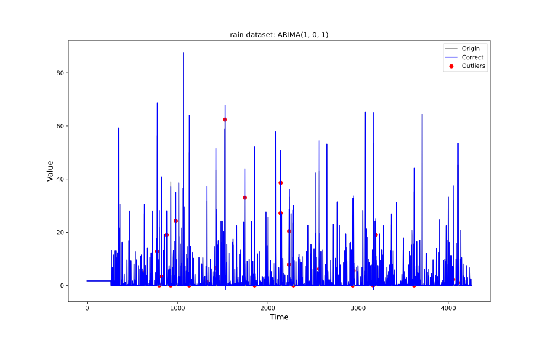


Zauważyć można praktycznie podobne dopasowanie modelu końcowego z początkowym, jednak poprawiony model może przyjąć wartości poniżej 0. Metoda nie wskazała wyjątków dla wartości powyżej 60, jednak wskazuję wyjątki dla wartości niższych gdzie wystąpiła nieregularność.


### Podsumowanie i wnioski

Testy zostały przeprowadzone dla różnych stopni modelu ARIMA

Algorytm jest efektywny w wykrywaniu wyjątków dla naturalnych zbiorach danych. Metoda potrafi dobrze dopasować się do trendów.

Zauważyć można problemy algorytmu z wykrywaniem wyjątków dla pierwszych danych serii, które są licznie wykrywane. Co za może doprowadzić do niechcianego efektu powiększenia anomalii w szeregu.
Algorytm nie jest świadomy przekraczania wartości 0. Z tego powodu rozwiązanie nie nadaję się dla danych bliskim zeru.

Algorytm jest w stanie przetwarzać większe zbiory danych, jednak obliczenia stają się bardziej czasochłonne z powodu konieczności przeprowadzenia obliczeń dla całego okna.

## Testy obciążeniowe serwisu

Sprawdzenie efektywniości interfejsu REST zostały przeprowadzone korzystając z narzędzia vegeta [@vegeta].
Testy skupiły się na ocenie zachowania systemu w określonych warunkach obciążenia. Celem jest określenie zachowania systemu i metryk wydajnościowych, gdy jest on poddany różnym poziomom symulowanej aktywności użytkowników.

Najważniejszymi metrykami podczas testów był stosunek poprawnych odpowiedzi http i opóźnienie przy ustalonej liczbie żądań na sekundę.


### Health check

`GET /health` jest najprostszym zapytaniem, który serwis udostępnia. Statystyki z takiego testu mogą być przydatne w dalszej analizie skuteczności implementacji serwisu. Z powodu że zapytanie nie jest ściśle związany z modułem algorytmu, może być przydatny w dalszym wykazywaniu skuteczności modułów.
W przypadku niesatysfakcjonujących wyników, może wskazywać na problemy z serwerem http lub infrastrukturą chmurową.

|Liczba żądań       |50.07/s      | 100.07/s      |200.07/s      |
| ----------------- | ----------- |  ------------ | ------------ |
|Żądania            |750          | 1500          |3000          |
|Czas trwania       |15.022s      | 15.031s       |15.038s       |
|Opóźnienie min     |139.638µs    | 180.257µs     |110.841µs     |
|Opóźnienie mediana |47.741ms     | 43.49ms       |46.401ms      |
|Opóźnienie max     |218.533ms    | 134.481ms     |156.174ms     |
|Sukces             |99.47%       | 99.60%        |99.70%        |
|Kody stanu         |0:4  200:746 | 0:6  200:1494 |0:9  200:2991 |


### Generowanie efektów

W tabelach przestawiono wyniki testów obciążeniowych dla poszczególnych funkcji API. Testy dotyczące generowania efektów miały za zadanie wykonanie obliczeń 1000 elementowego efektu, który zaczyna się w punkcie 50 o wielkości 10.

| Liczba żądań | 50.07/s    | 100.06/s   | 200.07/s   |
|--------------|------------|------------|------------|
| Żądania      | 750        | 1500       | 3000       |
| Czas trwania | 15.029s    | 15.042s    | 15.04s     |
| Opóźnienie min. | 202.521µs | 132.251µs  | 130.178µs |
| Opóźnienie mediana | 45.457ms | 46.072ms   | 44.057ms  |
| Opóźnienie max. | 496.62ms  | 151.204ms  | 281.249ms |
| Sukces       | 98.13%     | 99.73%     | 99.73%     |
| Kody stanu   | 0:14  200:736 | 0:4  200:1496 | 0:8  200:2992 |
: Wyniki testu obciążenia cieżki `/ao_effect`


| Liczba żądań | 50.06/s    | 100.06/s   | 200.06/s   |
|--------------|------------|------------|------------|
| Żądania      | 750        | 1500       | 3000       |
| Czas trwania | 15.026s    | 15.035s    | 15.054s    |
| Opóźnienie min. | 180.174µs | 200.016µs  | 115.782µs |
| Opóźnienie mediana | 45.836ms  | 47.123ms   | 59.712ms   |
| Opóźnienie max. | 134.011ms  | 143.69ms   | 193.445ms  |
| Sukces       | 99.60%     | 99.73%     | 99.73%     |
| Kody stanu   | 0:3  200:747 | 0:4  200:1496 | 0:8  200:2992 |
: Wyniki testu obciążenia cieżki `/ls_effect`


| Liczba żądań | 50.07/s    | 100.06/s   | 200.07/s   |
|--------------|------------|------------|------------|
| Żądania      | 750        | 1500       | 3000       |
| Czas trwania | 15.041s    | 15.162s    | 27.606s    |
| Opóźnienie min. | 183.003µs | 164.242µs  | 46.24µs    |
| Opóźnienie mediana | 57.178ms | 59.564ms   | 6.027s     |
| Opóźnienie max. | 169.284ms | 186.222ms  | 16.834s    |
| Sukces       | 99.87%     | 99.73%     | 97.67%     |
| Kody stanu   | 0:1  200:749 | 0:4  200:1496 | 0:70  200:2930 |
: Wyniki testu obciążenia cieżki `/tc_effect`


| Liczba żądań | 50.06/s    | 100.06/s   | 200.06/s   | 500.06/s   |
|--------------|------------|------------|------------|------------|
| Żądania      | 750        | 1500       | 3000       | 7500       |
| Czas trwania | 15.038s    | 15.072s    | 27.524s    | 44.97s     |
| Opóźnienie min. | 167.545µs | 166.943µs  | 54.649µs   | 39.469µs   |
| Opóźnienie mediana | 59.507ms | 73.718ms   | 6.046s     | 23.408s    |
| Opóźnienie max. | 174.438ms | 185.772ms  | 18.881s    | 30.001s    |
| Sukces       | 99.60%     | 99.40%     | 97.10%     | 47.00%     |
| Kody stanu   | 0:3  200:747 | 0:9  200:1491 | 0:87  200:2913 | 0:3975  200:3525 |
: Wyniki testu obciążenia cieżki `/io_effect` dla modelu ARIMA(3,0,2)


## Wioski

Przeprowadzone testy wykazały odporność środowiska chmurowego i aplikacji na nagłe zwiększenie ruchu sieciowego. Infrastruktura chmurowa efektywnie zachowywała stabilność podczas zwiększonego obciążenia.
Aplikacja przeszła test pomyślnie. Zauważyć można spadki wydajności przy bardziej zaawansowanych obliczeniach tj. `/io_effect`, gdzie przy obciążeniu pięciuset żądań na sekundę ilość odpowiedzi `OK` zmniejszyła się o połowę. W przypadku kiedy zwiększonego ruchu, budowa aplikacji i chmura GCP umożliwia rozszerzenie
horyzontalne serwisu co pozwoli w łatwy sposób rozwiązać problemy z dostępnością.

# Bibliografia

